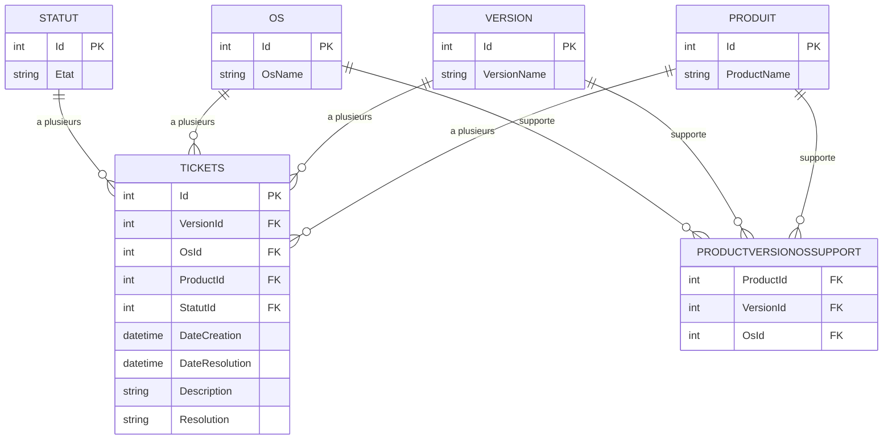

# 🔍 Projet6 - Application Console NexaWork

[](https://dotnet.microsoft.com/download/dotnet/8.0)
[](https://docs.microsoft.com/en-us/ef/)
[](https://docs.microsoft.com/en-us/sql/database-engine/configure-windows/sql-server-express-localdb)
[](LICENSE)

> **Application console .NET 8 pour la gestion et l'interrogation des tickets de support technique NexaWork**

Une alternative légère et performante à l'interface web, offrant toutes les fonctionnalités de requêtes LINQ dans une interface console intuitive avec emojis.

## 📋 Table des matières

- [Vue d'ensemble](#-vue-densemble)
- [Fonctionnalités](#-fonctionnalités)
- [Architecture](#-architecture)
- [Installation](#-installation)
- [Utilisation](#-utilisation)
- [Modèle de données](#-modèle-de-données)
- [Configuration](#-configuration)
- [Développement](#-développement)
- [Performance](#-performance)
- [Contribution](#-contribution)

## 🎯 Vue d'ensemble

L'application **Projet6** est une interface console moderne qui permet d'interroger efficacement la base de données des tickets de support de NexaWork. Elle implémente les 20 requêtes LINQ demandées dans une architecture optimisée et une interface utilisateur intuitive.

### 🏢 Contexte NexaWork

NexaWork développe 4 produits logiciels sur multiple plateformes :
- **Trader en Herbe** - Application de trading pour débutants
- **Maître des Investissements** - Plateforme d'investissement avancée  
- **Planificateur d'Entraînement** - Application de fitness et sport
- **Planificateur d'Anxiété Sociale** - Application de bien-être mental

## ✨ Fonctionnalités

### 🔍 4 Requêtes principales
- **Requête 1** : Problèmes par statut, produit et version
- **Requête 2** : Problèmes par période, statut, produit et version  
- **Requête 3** : Recherche par mots-clés dans un statut, produit et version
- **Requête 4** : Combinaison période + mots-clés + statut + produit + version

### 🎯 Workflow utilisateur
Chaque requête suit le même workflow intuitif :
1. **Sélection du statut** (En cours / Résolu / Les deux)
2. **Sélection du produit** (4 produits + option "Tous")
3. **Sélection de la version** (versions disponibles + option "Tous") 
4. **Paramètres spécifiques** selon la requête :
   - **Requête 2 & 4** : Saisie des dates (AAAA-MM-JJ)
   - **Requête 3 & 4** : Saisie des mots-clés (séparés par virgules)

### 🎨 Interface console
- **Navigation par menu numéroté** avec emojis
- **Validation robuste** des saisies utilisateur
- **Affichage formaté** des résultats avec troncature intelligente
- **Gestion d'erreurs** complète avec messages explicites
- **Options flexibles** : choix "Tous" pour produits et versions

### ⚡ Performance
- **Démarrage ultra-rapide** (< 2 secondes)
- **Consommation mémoire réduite** (~50 MB)
- **Requêtes optimisées** avec Entity Framework Core
- **Pas de serveur web** à gérer

## 🏗️ Architecture

```
Projet6/
├── 📁 Models/                    # Modèles de données
│   ├── TicketModel.cs           # Entité principale des tickets
│   ├── ProductModel.cs          # Produits NexaWork
│   ├── VersionModel.cs          # Versions des produits
│   ├── OsModel.cs              # Systèmes d'exploitation
│   ├── StatutModel.cs          # Statuts des tickets
│   └── ProductVersionOsSupport.cs # Table de compatibilité
├── 📁 Data/                     # Contexte et données
│   ├── NexaWorksContext.cs     # DbContext Entity Framework
│   └── Seed/
│       └── SeedData.cs         # Données d'amorçage (25 tickets)
├── 📁 Services/                 # Services métier
│   └── TicketQueryService.cs   # Service de requêtes LINQ optimisé
├── 📁 Migrations/              # Migrations Entity Framework
├── 📄 Program.cs               # Point d'entrée et interface console
├── 📄 appsettings.json        # Configuration base de données
└── 📄 README.md               # Documentation
```

### 🔧 Technologies utilisées

- **.NET 8** - Framework principal
- **Entity Framework Core 8.0.11** - ORM pour la base de données
- **SQL Server LocalDB/Express** - Base de données
- **Microsoft.Extensions.Hosting** - Injection de dépendances
- **Microsoft.Extensions.Configuration** - Gestion de configuration

## 🚀 Installation

### Prérequis

- [.NET 8 SDK](https://dotnet.microsoft.com/download/dotnet/8.0)
- SQL Server LocalDB ou SQL Server Express
- Visual Studio 2022 ou VS Code (optionnel)

### Étapes d'installation

1. **Cloner le repository**
   ```bash
   git clone [URL_DU_REPO]
   cd Projet6
   ```

2. **Restaurer les packages NuGet**
   ```bash
   cd Projet6
   dotnet restore
   ```

3. **Configurer la base de données** (optionnel)
   ```json
   // Dans appsettings.json, modifier si nécessaire
   {
     "ConnectionStrings": {
       "DefaultConnection": "Server=(localdb)\\mssqllocaldb;Database=NexaWorksConsole;Trusted_Connection=true"
     }
   }
   ```

4. **Lancer l'application**
   ```bash
   dotnet run
   ```

> 💡 **Note** : La base de données et les données de test sont créées automatiquement au premier lancement.

## 🎮 Utilisation

### Menu principal

L'application propose un menu simplifié avec 4 requêtes optimisées :

```
🔍 MENU PRINCIPAL - REQUÊTES NEXAWORK
========================================

📋 PROBLÈMES EN COURS
1️⃣  Tous les problèmes en cours par produit et version

📅 PAR PÉRIODE  
2   Problèmes par période, produit et version

🔎 PAR MOTS-CLÉS
3   Recherche dans un produit et version

🔎📅 PAR PÉRIODE ET PAR MOTS-CLÉS
4   Recherche dans un produit et version

0️⃣  Quitter
```

### Exemple d'utilisation

1. **Sélection de requête**
   ```
   Choisissez une option (0-4) : 1
   ```

2. **Sélection de statut**
   ```
   📱 Sélection du statut :
   1: En cours
   2: Résolu  
   3: Les deux
   
   Choisissez un statut : 1
   ```

3. **Sélection de produit**
   ```
   🏢 Sélection du produit :
   1. Trader en Herbe : id 1
   2. Maître des Investissements : id 2
   3. Planificateur d'Entraînement : id 3
   4. Planificateur d'Anxiété Sociale : id 4
   5. Tous
   
   Choisissez un produit (numéro) : 3
   ```

4. **Sélection de version**
   ```
   📱 Sélection de la version :
   1. 1.1 : id: 2
   2. 2.0 : id: 5
   3. Tous
   
   Choisissez une version (numéro) : 2
   ```

5. **Affichage des résultats**
   ```
   📊 5 ticket(s) trouvé(s) :
   ────────────────────────────────────────────────────────────────
   🎫 Ticket #1 | Planificateur d'Entraînement v1.1 | iOS | En cours
      📅 Créé: 03/03/2024 | Résolu: En cours
      📝 L'application se ferme brutalement lors de la tentative d'importation...
   
   🎫 Ticket #3 | Planificateur d'Entraînement v2.0 | MacOS | En cours  
      📅 Créé: 05/04/2024 | Résolu: En cours
      📝 Fuite de mémoire critique identifiée lors de l'utilisation prolongée...
   ```

### Formats de saisie

#### 📅 Dates
```
Format attendu : AAAA-MM-JJ
Exemple : 2024-01-01
```

#### 🔍 Mots-clés
```
Format : mots séparés par des virgules
Exemple : mémoire, crash, GPS, audio
```

## 📊 Modèle de données

### Diagramme de base de données



### Relations détaillées

Le modèle suit une architecture relationnelle classique avec les relations suivantes :

- **PRODUIT** ↔ **TICKETS** : Un produit peut avoir plusieurs tickets (1:n)
- **VERSION** ↔ **TICKETS** : Une version peut avoir plusieurs tickets (1:n)  
- **OS** ↔ **TICKETS** : Un OS peut avoir plusieurs tickets (1:n)
- **STATUT** ↔ **TICKETS** : Un statut peut avoir plusieurs tickets (1:n)
- **PRODUCTVERSIONOSSUPPORT** : Table de jonction pour la compatibilité produit/version/OS (n:n:n)

### Données de référence

#### Produits (4)
| ID | Nom |
|----|-----|
| 1 | Trader en Herbe |
| 2 | Maître des Investissements |
| 3 | Planificateur d'Entraînement |
| 4 | Planificateur d'Anxiété Sociale |

#### Versions (6)
`1.0`, `1.1`, `1.2`, `1.3`, `2.0`, `2.1`

#### Systèmes d'exploitation (6)
`Linux`, `Windows`, `MacOS`, `Android`, `iOS`, `Windows Mobile`

#### Statuts (2)
`En cours`, `Résolu`

### Données de test

L'application contient **25 tickets** de test représentatifs :

- **13 tickets en cours** (52%)
- **12 tickets résolus** (48%)
- Problèmes réalistes : fuites mémoire, crashes, problèmes de sécurité, incompatibilités
- Répartition équilibrée entre produits, versions et OS

## ⚙️ Configuration

### Chaînes de connexion

L'application tente plusieurs connexions par ordre de priorité :

```json
{
  "ConnectionStrings": {
    "DefaultConnection": "Server=(localdb)\\mssqllocaldb;Database=NexaWorksConsole;Trusted_Connection=true",
    "SqlExpress": "Server=.\\SQLEXPRESS;Database=NexaWorksConsole;Trusted_Connection=true",
    "SqlServer": "Server=.;Database=NexaWorksConsole;Trusted_Connection=true"
  }
}
```

### Gestion automatique

- ✅ **Création automatique** de la base de données
- ✅ **Amorçage automatique** des données de test
- ✅ **Vérification d'intégrité** au démarrage  
- ✅ **Messages d'erreur détaillés** pour le debugging

## 👨‍💻 Développement

### Architecture du TicketQueryService

Le service utilise une **requête universelle** qui couvre toutes les variantes :

```csharp
public async Task<List<TicketModel>> GetTicketsAsync(
    string? statut = null,           // "En cours", "Résolu", ou null
    int? productId = null,           // ID produit ou null pour tous
    int? versionId = null,           // ID version ou null pour toutes
    DateTime? startDate = null,      // Date début ou null
    DateTime? endDate = null,        // Date fin ou null
    List<string>? keywords = null)   // Mots-clés ou null
```

**Les 4 requêtes publiques** sont des wrappers de cette méthode :
- `GetProblemsInProgressByProductVersionAsync()` - Requête 1
- `GetProblemsByPeriodProductVersionAsync()` - Requête 2  
- `GetProblemsByProductVersionKeywordsAsync()` - Requête 3
- `GetProblemsByPeriodProductVersionKeywordsAsync()` - Requête 4

### Avantages de cette approche
- **Réduction du code** : 1 méthode principale au lieu de 20
- **Flexibilité maximale** : Paramètres optionnels pour tous les cas
- **Performance optimisée** : Filtres appliqués au niveau SQL
- **Maintenance simplifiée** : Une seule méthode à maintenir

### Optimisations Entity Framework

- **Include() explicites** pour éviter le lazy loading
- **Indexes sur clés étrangères** pour améliorer les jointures
- **AsQueryable()** pour composition de requêtes
- **Tri intelligent** selon le type de requête

### Extensions possibles

#### 📄 Export CSV des résultats
```csharp
static void ExportToCsv(List<TicketModel> tickets, string filename)
{
    var csv = new StringBuilder();
    csv.AppendLine("Id,Produit,Version,OS,Statut,Date,Description");
    foreach (var ticket in tickets)
    {
        csv.AppendLine($"{ticket.TicketId},{ticket.Product?.ProductName}," +
                      $"{ticket.Version?.VersionName},{ticket.Os?.OsName}," +
                      $"{ticket.Statut?.State},{ticket.DateCreation:yyyy-MM-dd}," +
                      $"\"{ticket.Description.Replace("\"", "\"\"")}\"");
    }
    File.WriteAllText(filename, csv.ToString());
}
```

#### 🤖 Mode batch pour automatisation
```bash
dotnet run --statut="En cours" --produit="Trader en Herbe" --export="results.csv"
```

#### 📊 Requêtes supplémentaires
- Ajouter les 16 autres requêtes manquantes des spécifications originales
- Statistiques avancées par produit/OS/période
- Dashboard avec métriques de performance

## ⚡ Performance

### Comparaison avec ASP.NET Core

| Critère | Console | ASP.NET Core |
|---------|---------|--------------|
| **Complexité** | ⭐⭐ (Simple) | ⭐⭐⭐⭐⭐ (Complexe) |
| **Performance** | ⭐⭐⭐⭐⭐ (Excellent) | ⭐⭐⭐ (Bon) |
| **Démarrage** | ⭐⭐⭐⭐⭐ (< 2s) | ⭐⭐ (5-10s) |
| **Maintenance** | ⭐⭐⭐⭐⭐ (Facile) | ⭐⭐⭐ (Moyen) |
| **Interface** | ⭐⭐ (Console) | ⭐⭐⭐⭐⭐ (Web) |
| **Déploiement** | ⭐⭐⭐⭐⭐ (Simple) | ⭐⭐ (Complexe) |

### Métriques

- 🚀 **Démarrage** : < 2 secondes
- 💾 **Mémoire** : ~50 MB
- 🔄 **25 tickets** traités instantanément
- 📊 **4 requêtes** optimisées disponibles

## 🎯 Cas d'usage

### ✅ Parfait pour
- **Démonstrations rapides** des requêtes LINQ simplifiées
- **Tests de performance** de la base de données  
- **Prototypage** de nouvelles fonctionnalités de recherche
- **Formation** aux concepts Entity Framework et injection de dépendances
- **Debugging** de la logique métier sans complexité web
- **Scripts d'interrogation** rapide de la base NexaWork

### ❌ Moins adapté pour
- Interface utilisateur grand public (préférer ASP.NET Core)
- Accès concurrent de nombreux utilisateurs
- Implémentation des 20 requêtes complètes (seulement 4 implémentées)
- Intégration web ou APIs REST

## 🚨 Dépannage

### Problèmes courants

#### ❌ Erreur de connexion à la base de données
```
💡 Solutions :
1. Installez SQL Server LocalDB
2. Vérifiez la chaîne de connexion dans appsettings.json
3. Essayez SQL Server Express
```

#### ❌ Tables non trouvées
```
💡 Solutions :
1. Supprimez le dossier Migrations/
2. Relancez l'application (recréation automatique)
3. Vérifiez que SeedData.cs est complet
```

#### ❌ Aucune donnée affichée
```
💡 Solutions :
1. Vérifiez que les 25 tickets sont en base
2. Relancez avec une base vide (recréation auto)
3. Vérifiez les filtres de requête
```

## 🤝 Contribution

### Développement local

1. **Fork** le projet
2. **Créer** une branche feature (`git checkout -b feature/AmazingFeature`)
3. **Commit** vos changements (`git commit -m 'Add some AmazingFeature'`)
4. **Push** vers la branche (`git push origin feature/AmazingFeature`)
5. **Ouvrir** une Pull Request

### Standards de code

- **C# 12** avec nullable reference types
- **Async/await** pour toutes les opérations I/O
- **Injection de dépendances** pour la testabilité
- **Entity Framework Core** best practices

## 📜 License

Ce projet est sous licence MIT. Voir le fichier [LICENSE](LICENSE) pour plus de détails.

## 📞 Support

- 🐛 **Issues** : [GitHub Issues](../../issues)

---
